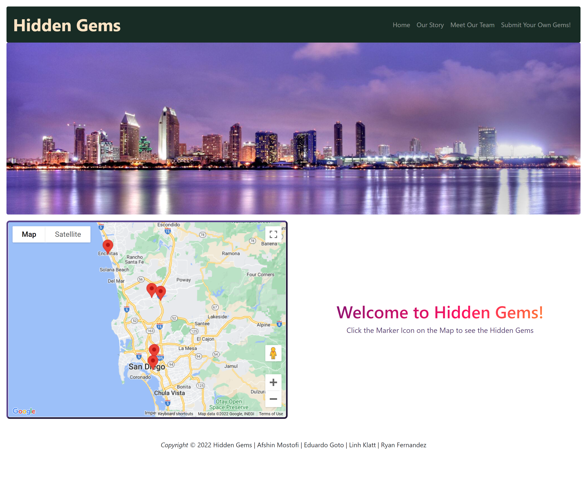
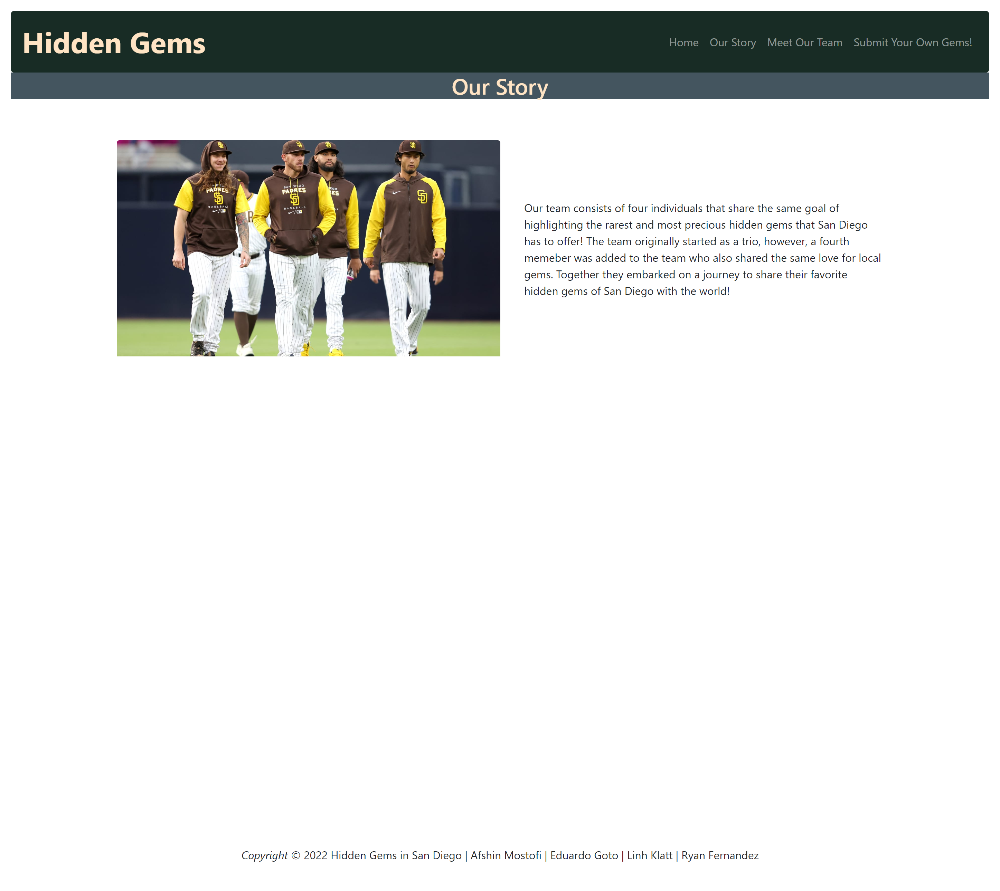
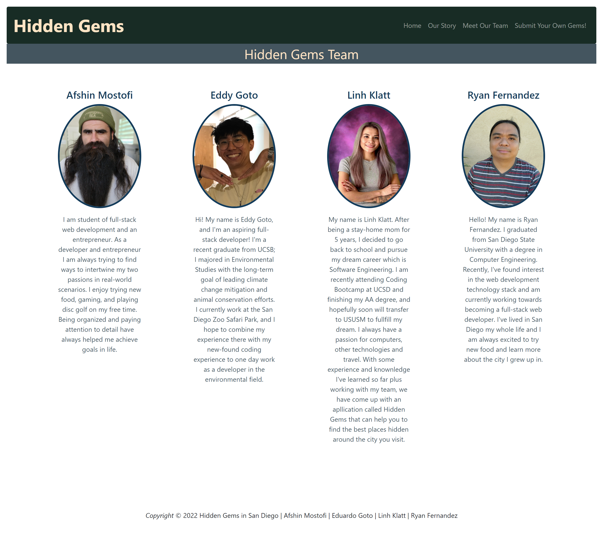
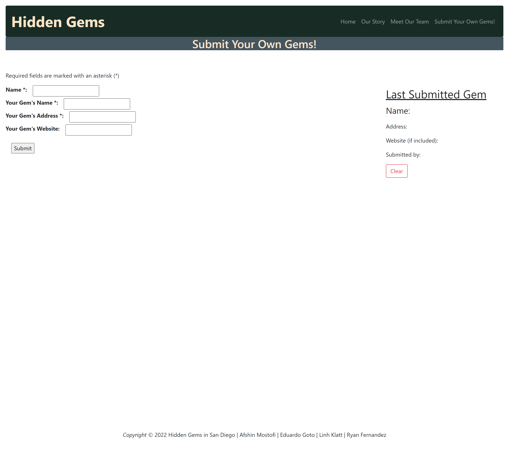
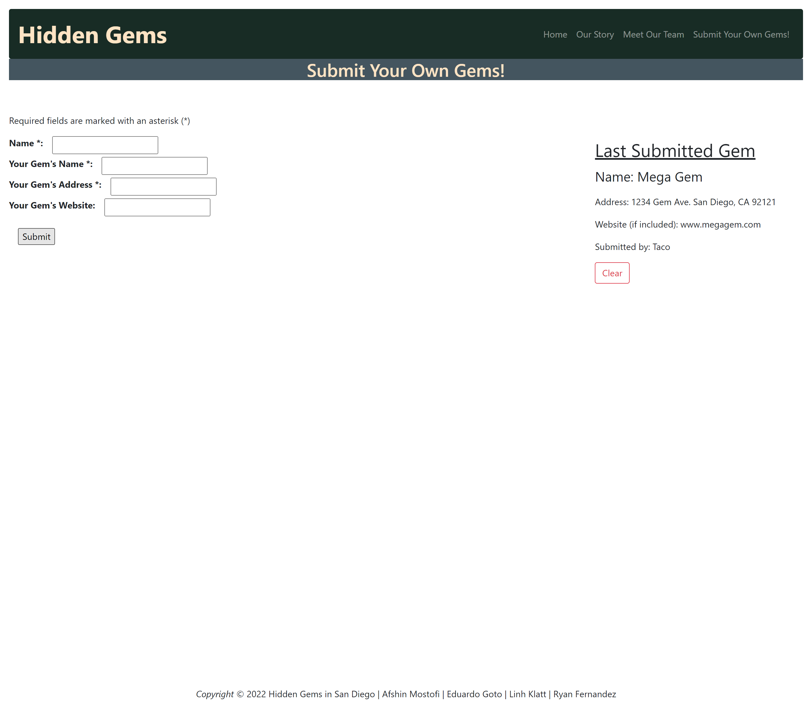

# Hidden Gems

### URL : https://eddygoto.github.io/Project-1-Travel-Site/

## Description

A website that displays a map with hidden gems placed using markers. The user can select the marker and view and image, the address, and the 3 most recent reviews for the location. User wil also be able to submit their own hidden gems on the submit page.

## User Story

```
- AS A tourist that wants try new things
- I WANT to find popular places to visits known amongst locals
- SO THAT I can have more exclusive expierence than the average tourist
```

## Acceptance Criteria

```
- GIVEN I am using a map to view hidden gems
- WHEN I click a marker
- THEN the window displays with image, addresss, and reviews are populated
- GIVEN A submit field to enter a hidden gem
- WHEN I enter the required field
- THEN I am presented the information being saved as confirmation
```

## Usage

- This map displays marked hidden gems that also provides details and reviews.
- Once the users hidden gem is submitted it will store in their local storage.
- This webpage is desktop and mobile compatible.

## Mock-Up

Upon Arrival, User is welcomed and presented with 5 markers to select on the map.


Once a marker is selected a link, details and reviews are provided for that location.


A simple page that describes our story.


Bios of the deveolpment team.


A page for the user to submit their own gem!


Once the gem is entered, user is provided confirmation that submission is stored.


## Technologies Used

- HTML
- CSS
- JavaScript
-3rd Part APIs Used:  
    -Google Maps
    -Google Places
